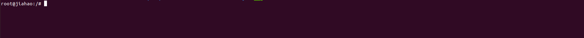
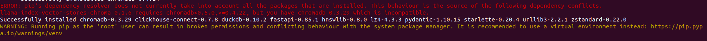
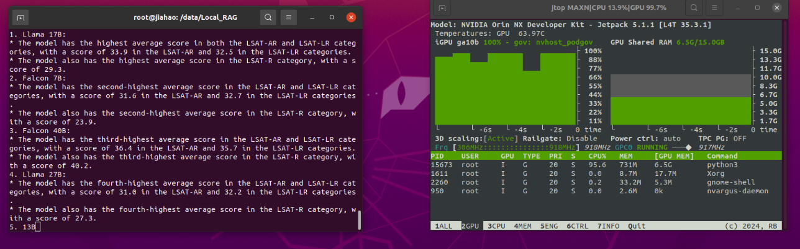

# RAG_based_on_Jetson
This project has implemented the RAG function on Jetson and supports TXT and PDF document formats. It uses MLC for 4-bit quantization of the Llama2-7b model, utilizes ChromaDB as the vector database, and connects these features with Llama_Index. I hope you like this project.

# Hardware Prepare
Here I use reComputer J4012 powered by NVIDIA [Jetson Orin NX 16GB](https://www.seeedstudio.com/reComputer-J4012-p-5586.html), this project will use RAM at a peak of 11.7GB.

# Run this project
## Step 1: prepare environment

```
# install jetson-container and its requirements

git clone --depth=1 https://github.com/dusty-nv/jetson-containers
cd jetson-containers 
pip install -r requirements.txt 
cd data
```

```
# Install RAG project and llama2-7b model after 4bit quantification

git clone https://github.com/Seeed-Projects/RAG_based_on_Jetson.git 
sudo apt-get install git-lfs
cd RAG_based_on_Jetson
git clone https://huggingface.co/JiahaoLi/llama2-7b-MLC-q4f16-jetson-containers 
cd ..
```

## Step 2: run and enter the docker 

```cd .. && ./run.sh $(./autotag mlc) ```


```
# Those command will run in this docker 
cd data/RAG_based_on_Jetson && pip install -r requirements.txt
pip install chromadb==0.3.29
```

>Note: If you get this error please ignore it.



## step 3: run the project

```
# Command run in docker 
python3 RAG.py
```


# Result 
Below is the live demo, and the blue text is the context search from ChromaDB will be the context of the question

[](https://youtu.be/v1SDRko5cNM)

